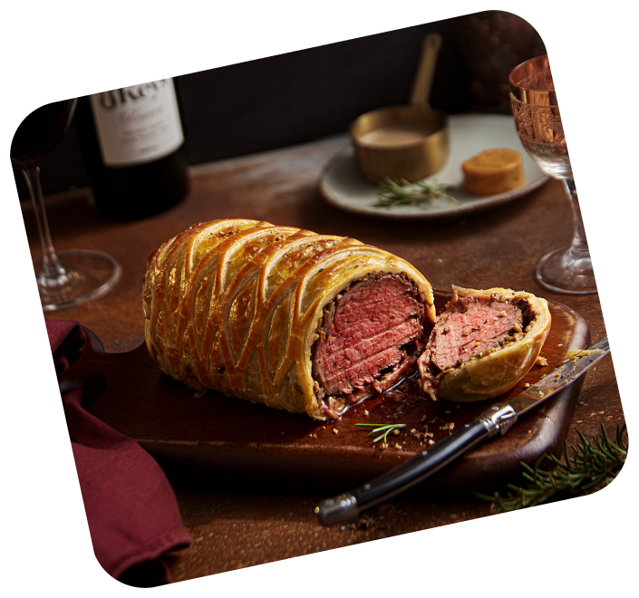

# Foodies - Recipe Website

A pixel-perfect recreation of a Figma design for a food recipe website called "Foodies". This project demonstrates modern web development techniques with a focus on accessibility, responsiveness, and user experience.



## 🌟 Features

- **Pixel-Perfect Design**: Meticulously recreated from the original Figma design
- **Fully Responsive**: Optimized for mobile, tablet, and desktop devices
- **Accessible**: WCAG compliant with proper ARIA labels, keyboard navigation, and semantic markup
- **Interactive Components**: Modal dialogs, form validation, testimonial carousel
- **Modern CSS**: Uses CSS custom properties, flexbox, grid, and advanced selectors
- **Smooth Animations**: Scroll-triggered animations and hover effects
- **Form Validation**: Real-time client-side validation with proper error handling

## 🛠️ Technologies Used

- **HTML5**: Semantic markup with accessibility in mind
- **CSS3**: Modern CSS with custom properties, grid, flexbox
- **JavaScript (ES6+)**: Modular, accessible interactive components
- **Design System**: Comprehensive CSS variables for consistent styling

## 📱 Responsive Breakpoints

- **Mobile**: 320px - 640px
- **Tablet**: 640px - 1024px
- **Desktop**: 1024px - 1280px
- **Large Desktop**: 1280px+

## 🎨 Design System

### Colors
- **Primary**: Orange/Red gradient (#FF6B35 to #E55A2E)
- **Grayscale**: Complete range from white to black
- **Category Colors**: Unique pastel colors for each food category

### Typography
- **Font**: Inter (with fallbacks)
- **Scale**: Responsive typography with 8 size variants
- **Weights**: Light to Black (300-900)

### Spacing
- **Base Unit**: 8px system for consistent spacing
- **Scale**: 4px to 128px with semantic naming

## 🏗️ Project Structure

```
foodiescorp/
├── index.html              # Main HTML file
├── css/
│   ├── variables.css        # CSS custom properties
│   ├── base.css            # Reset and base styles
│   ├── components.css       # Component styles
│   ├── layout.css          # Layout and sections
│   └── responsive.css       # Media queries
├── js/
│   └── main.js             # Interactive functionality
├── assets/
│   ├── images/             # Hero images and decorations
│   └── icons/              # Icon assets
└── README.md               # This file
```

## 🚀 Getting Started

1. **Clone or download** this repository
2. **Open** `index.html` in a modern web browser
3. **Or serve** the files using a local server:

```bash
# Using Python
python -m http.server 8000

# Using Node.js
npx serve .

# Using PHP
php -S localhost:8000
```

## ✨ Key Components

### Header
- Fixed position with blur backdrop
- Responsive navigation menu
- Authentication buttons
- User profile (when logged in)

### Hero Section
- Gradient background
- Responsive images from Figma
- Floating decorative elements
- Call-to-action button

### Categories Grid
- Masonry-style layout
- 11 different food categories
- Hover animations
- Responsive grid system

### Testimonials
- Rotating testimonial carousel
- Navigation dots
- Auto-play functionality
- Decorative quote icon

### Modals
- Sign in / Sign up forms
- Form validation
- Keyboard navigation
- Focus trapping

## 🎯 Accessibility Features

- **WCAG 2.1 AA Compliant**
- **Keyboard Navigation**: Full keyboard support
- **Screen Reader Support**: Proper ARIA labels and roles
- **Focus Management**: Visible focus indicators
- **Skip Links**: Skip to main content
- **Semantic HTML**: Proper heading hierarchy and landmarks
- **Color Contrast**: Meeting accessibility requirements
- **Reduced Motion**: Respects user motion preferences

## 🌐 Browser Compatibility

- **Chrome** 88+
- **Firefox** 85+
- **Safari** 14+
- **Edge** 88+

## 📋 Features Implemented

- [x] Pixel-perfect Figma recreation
- [x] Responsive design (mobile-first)
- [x] Accessibility compliance (WCAG 2.1 AA)
- [x] Interactive modals and forms
- [x] Form validation and error handling
- [x] Testimonial carousel
- [x] Scroll animations
- [x] Modern CSS architecture
- [x] Clean JavaScript organization
- [x] Cross-browser compatibility

## 🔧 Customization

The website uses a comprehensive design system built with CSS custom properties. You can easily customize:

- **Colors**: Edit `css/variables.css`
- **Typography**: Modify font scales and families
- **Spacing**: Adjust the 8px-based spacing system
- **Components**: Modify individual component styles

## 📝 Code Quality

- **Clean Code**: Well-organized, commented, and maintainable
- **Modern Standards**: Uses latest web standards and best practices
- **Performance**: Optimized for fast loading and smooth interactions
- **SEO Friendly**: Proper meta tags and semantic structure

## 🚧 Future Enhancements

- Backend integration for user authentication
- Recipe search and filtering functionality
- User recipe submission
- Recipe details pages
- Shopping list features
- Social sharing functionality

## 📄 License

This project is created for demonstration purposes based on a Figma design. All assets and design elements belong to their respective owners.

---

**Developed with ❤️ by following modern web development best practices**